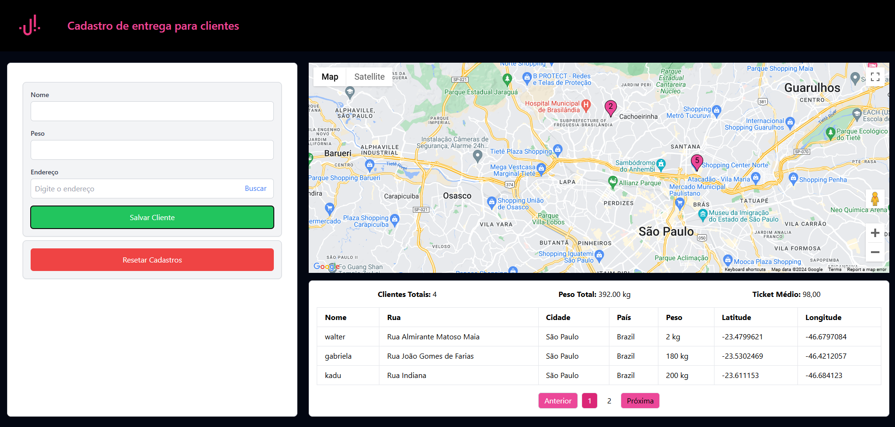
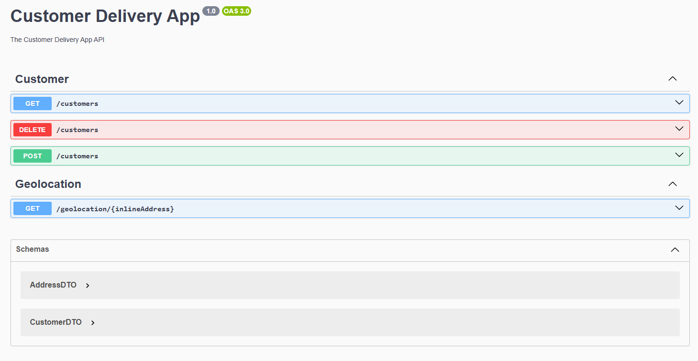

# DeliveryApp

### Descrição

Esse é um projeto fullstack, com integração à uma api externa (Google maps api) portanto necessita de uma chave para sua utilização!

Frontend conta com tecnologias como: [React](https://react.dev/), [Tailwind](https://tailwindcss.com/) e [Typescript](https://www.typescriptlang.org/)!

Backend conta com tecnologias como: [Nest](https://github.com/nestjs/nest), e [Typescript](https://www.typescriptlang.org/)

Ambos os projetos rodam com uso do [Docker](https://www.docker.com/), com o docker-compose. O mesmo é responsável por criar os containers de serviços: banco de dados [PostgreSQL](https://www.postgresql.org/), Frontend e Backend.

### Pré-requisitos

Antes de começar, você vai precisar ter instalado em sua máquina a seguintes ferramenta: [Docker](https://www.docker.com/).

🔺 Após clonar o repositório e acessar a pasta do mesmo, abra o docker-compose.yml e adicione a chave do google cloud nas duas ocorrencias da string YOUR_KEY_HERE 🔺

### 🎲 Rodando o Projeto

```bash
# Na raiz do projeto, rode o comando abaixo para criar e iniciar os containers. 
# A segunda parte do comando é responsável por criar as tabelas no banco de dados. 
$ docker-compose up --detach --build; docker-compose exec backend npx prisma migrate deploy
```

###  Informações do ambiente
O projeto frontend utilizará a porta 3000, o backend utilizará a porta 8080 e o banco de dados utilizará a porta 5432.

Frontend poderá ser acessado em: http://localhost:3000


Backend (Swagger) poderá ser acessado em: http://localhost:8080/api

